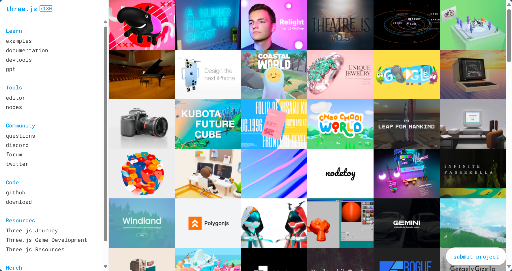
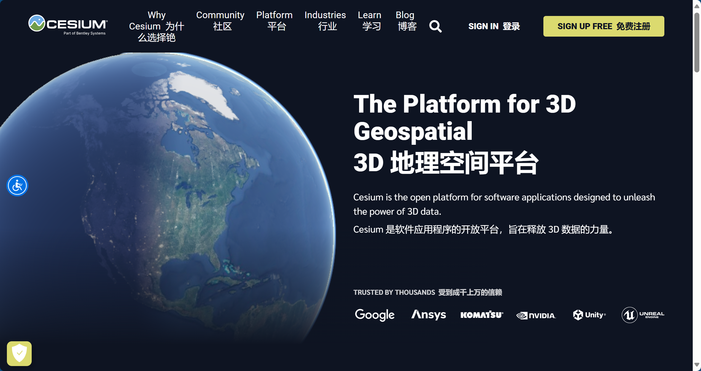
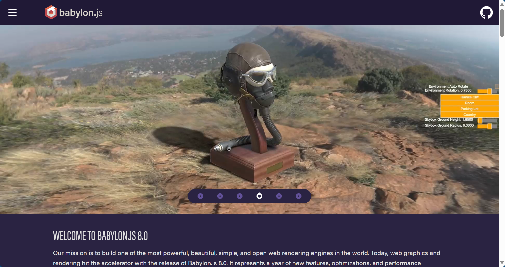
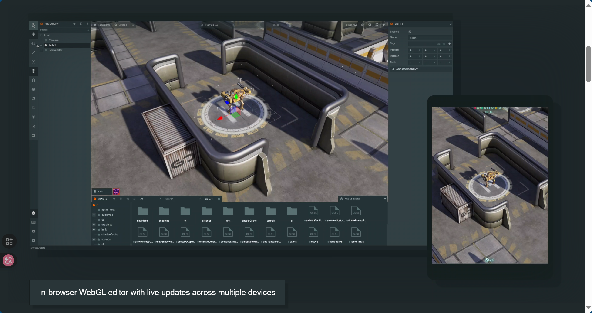
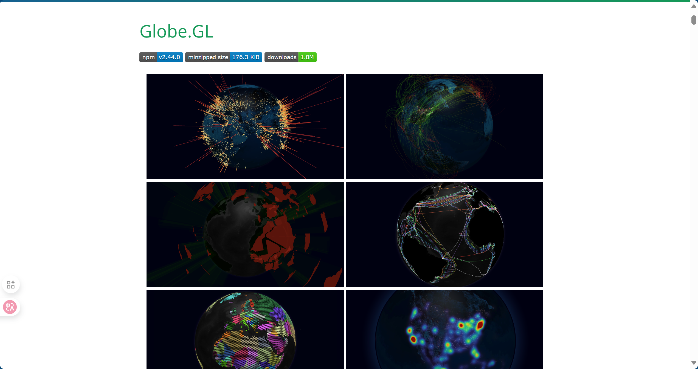
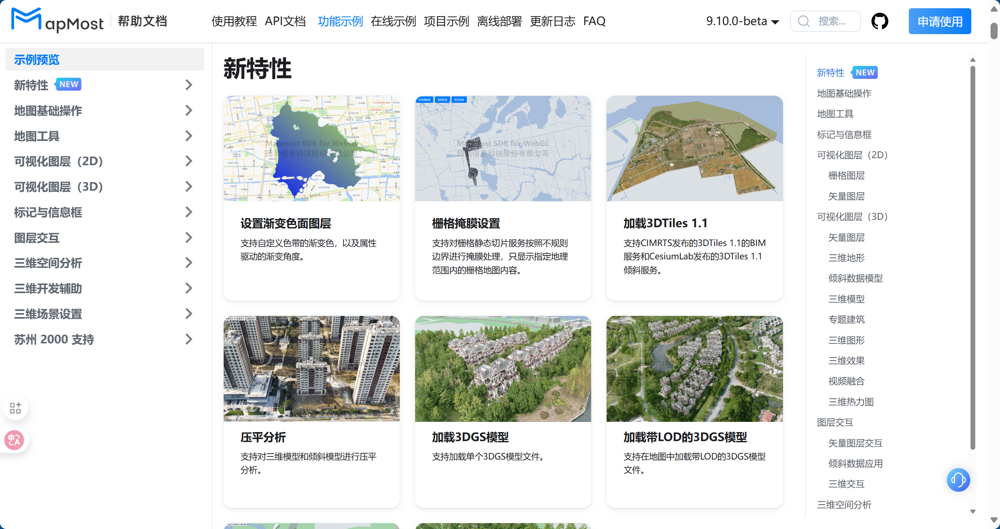

# WebGL 概述

>本节讲述 WebGL 的用途，以及 WebGL、OpenGL、Three.js 和 Cesium 之间的联系。

## 什么是 WebGL？

WebGL 是基于嵌入式系统开放图形库（OpenGL ES）的图形 Javascript API，它允许在  网页浏览器中通过 HTML 的 `<canvas>` 标签呈现 3D 和 2D 图形 。

WebGL 程序包含用 OpenGL **着色语言（GLSL）**、Javascript 和 HTML5 编写的代码。GLSL 用于编写着色器以及在图形硬件上执行的特殊程序，这些程序在渲染对象或场景期间计算顶点、纹理、颜色和光照等属性。Javascript 和 HTML5 主要用作绑定语言并提供呈现上下文。

WebGL 程序通常是通过 **图形处理单元**（GPU）经过渲染管线的处理，在画布 HTML 元素上进行多次绘制生成的。

## 基于 WebGL 的三维引擎

### Three.js

[Three.js](https://threejs.org/) 是基于 WebGL 的 3D Javascript 库，它封装了 **场景、相机、几何、3D 模型加载器、灯光、材质、着色器、动画、粒子、数学工具** 等。

这样的封装为开发人员提供了一个简单直观的 API，使他们能够在 Web 上创建交互式 3D 体验。

### Cesium

[Cesium](https://cesium.com/) 是一个基于 WebGL 的三维地球与地图可视化框架。

- WebGL 是底层图形接口：它直接调用 GPU、让浏览器能绘制 3D 场景，属于“渲染引擎层”。
- Ceisum 是上层封装框架：它基于 WebGL 封装了一整套地图、地形、坐标系、相机控制、时间轴、数据格式等逻辑，属于“应用层”。

### Babylon.js

[Babylon.js](https://www.babylonjs.com/) 是由微软开发的一个 3D 引擎，专注于 WebGL 和 WebXR。它具有高性能、可扩展性和开放性的特点，适用于创建复杂的 3D 场景和游戏。

### PlayCanvas

[PlayCanvas](https://playcanvas.com/) 是一个云端的游戏和应用引擎，使用 WebGL 进行渲染。它提供了强大的编辑器、物理引擎和渲染引擎，是用于开发 2D 和 3D 游戏以及交互性应用。

### Global.GL

[Global.GL](https://globe.gl/) 是一个 Javascript 库，允许开发人员在浏览器中创建交互式和可自定义的 3D 地球仪和地图。它建立在 WebGL 之上，提供了一系列用于可视化地理空间数据的功能，包括标记、弧线、路径和热力图。

### Mapmost

[Mapmost](https://www.mapmost.com/#/) 是国内厂商开发的一款基于 WebGL 的三维地图引擎。提供了多种时空数据融合接入能力，如矢量、影像、倾斜、手工模型、视频等数据源。

