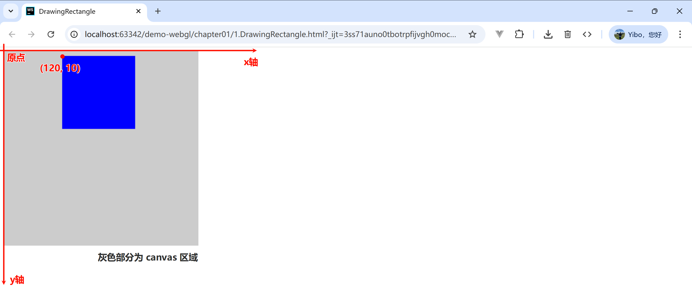
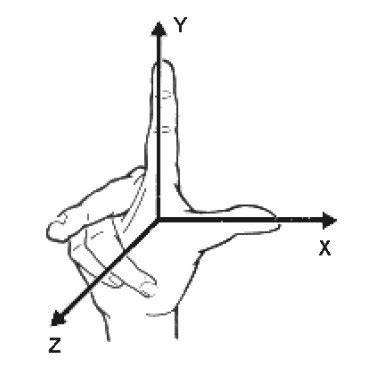
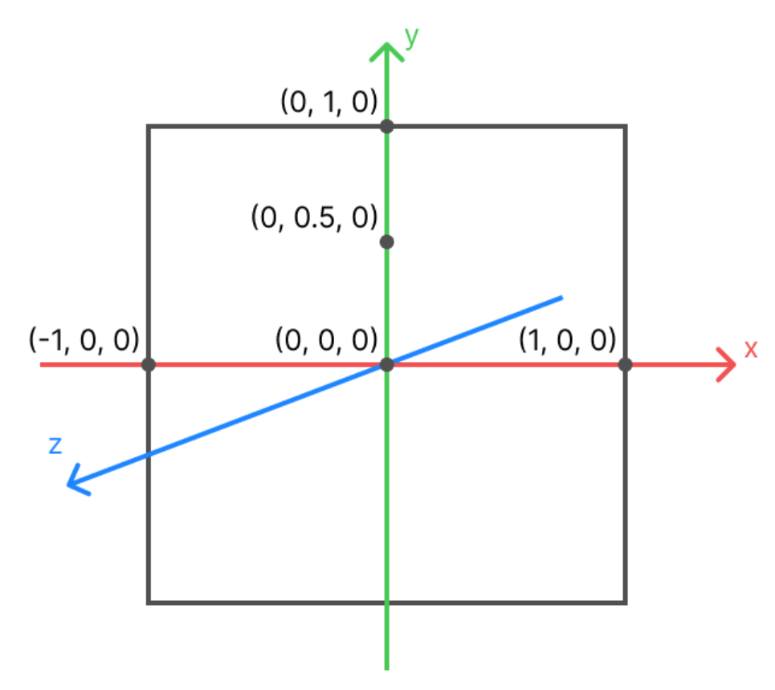

# 坐标系

>本节讲述 canvas 的坐标系和 WebGL 的坐标系，并通过案例展示如何将 canvas 下的坐标转换为 WebGL 的坐标。
>
>


## Canvas 坐标系

`<canvas>` 标签定义了网页上的绘图区域，让我们可以通过 Javascript 绘制任何想画的东西。

> [!TIP]
>
> `<canvas>` 的坐标系统 横轴为 x 轴（正方向朝右），纵轴为 y 轴（正方向朝下），原点落在左上方 。

下面案例使用 canvas 绘制了一个点：

```html
<!DOCTYPE html>
<html lang="en">
  <head>
    <meta charset="UTF-8">
    <title>DrawingRectangle</title>
    <style>
      #example {
        background-color: #ccc;
      }
    </style>
  </head>
  <body>
    <canvas id="example" width="400" height="400">
      请使用支持 canvas 的浏览器查看
    </canvas>

    <script>
      const canvas = document.getElementById("example");
      if (!canvas) {
        console.log("Failed to load canvas element.");
      }
      // 获取 2d 绘图上下文
      const ctx = canvas.getContext("2d");
      // 绘制蓝色的矩形
      ctx.fillStyle = "rgba(0, 0, 255, 1.0)";
      // ctx.fillRect(x坐标, y坐标, 宽度, 高度);
      ctx.fillRect(120, 10, 150, 150);
    </script>
  </body>
</html>
```




## WebGL 坐标系

WebGL 默认使用的是 <span class="marker-text-highlight"> **笛卡尔坐标系** </span> 的 **右手坐标系**，满足右手法则。即 X 轴向右，Y 轴向上，Z 轴面向观察者，原点位于画布中心。




需要特殊注意的是坐标值，它使用的是 <span class="marker-text-highlight"> **百分比** </span>。比如 X 轴的取值范围是 `[-1, 1]`， `-1` 表示在屏幕的最左侧，`1` 表示在屏幕左右侧。




## Canvas 坐标转 WebGL 坐标


