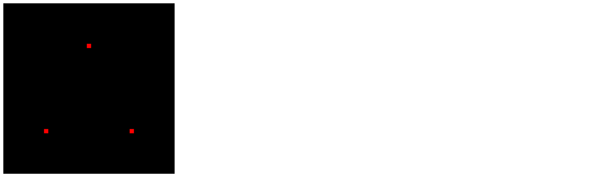
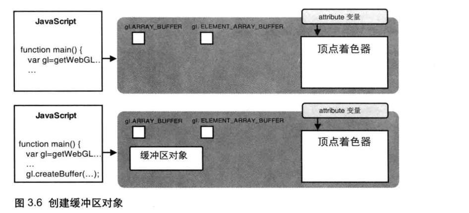
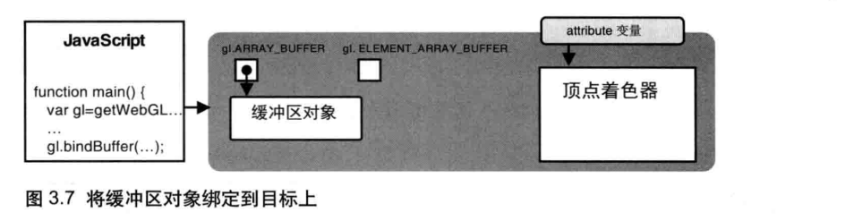
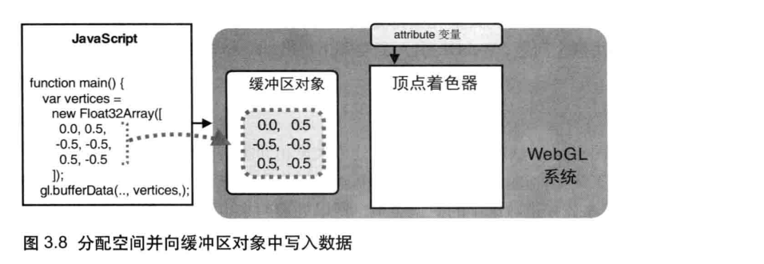
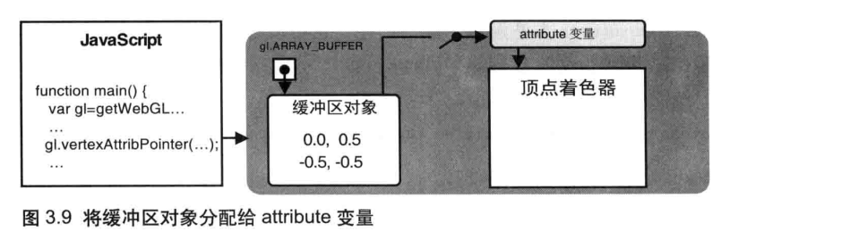
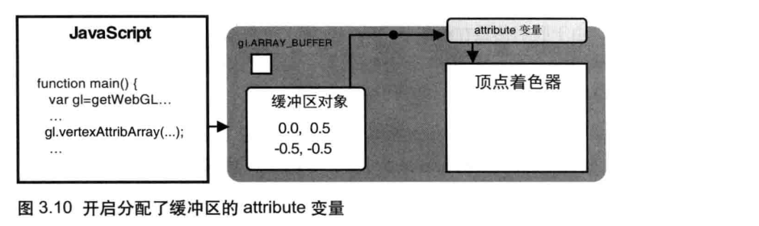
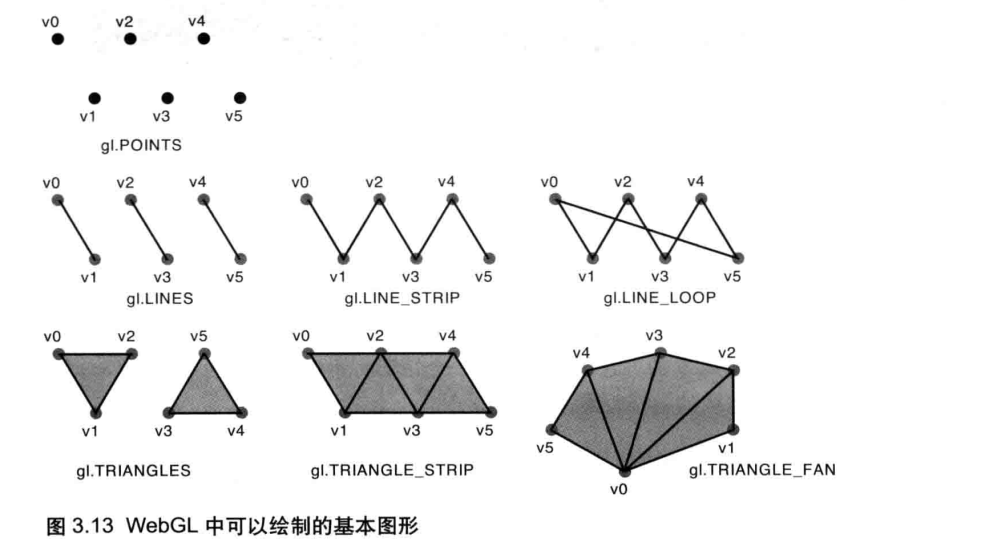
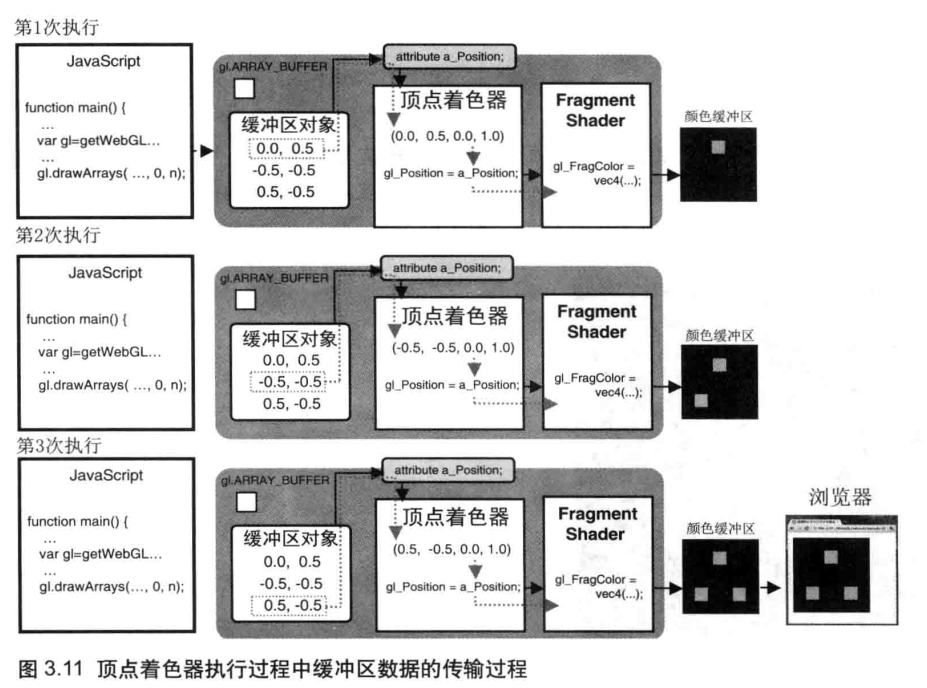

# 缓冲区对象

> 本节讲述 WebGL 缓冲区对象，使用缓冲区对象可以一次性将多个顶点数据分配给 attribute 变量，更加灵活高效。缓冲区对象也是给 attribute 变量赋值的一种方法。

缓冲区对象（buffer object）是 WebGL 系统中的一块内存区域，我们可以 <span class="marker-text-highlight"> 一次性地向缓冲区对象中填充大量的顶点数据，然后将这些数据保存在其中，供顶点着色器使用 </span>。

> [!NOTE] 提示 
>
> 使用缓冲区对象向顶点着色器传入多个顶点的数据，需要遵循以下五个步骤：
>
> 1. 创建缓冲区（`gl.createBuffer()`）
> 2. 绑定缓冲区（`gl.bindBuffer()`）
> 3. 将数据写入缓冲区（`gl.bufferData()`）
> 4. 将缓冲区对象分配给一个 attribute 变量（`gl.vertexAttribPointer()`）
> 5. 开启 attribute 变量（`gl.enableVertexAttribArray()`）


## 完整示例

下面的示例使用缓冲区对象绘制了三个点：

```html {67,69,71,74,79,81,84}
<!DOCTYPE html>
<html lang="en">
  <head>
    <meta charset="UTF-8">
    <title>绘制多个点</title>
  </head>
  <body>
    <canvas id="example" width="400" height="400">
      请使用支持 canvas 的浏览器查看
    </canvas>

    <script>
      const canvas = document.getElementById("example");
      if (!canvas) {
        console.log("Failed to load canvas element.");
      }
      // 获取 webgl 绘图上下文
      const gl = canvas.getContext("webgl");

      // 设置清空背景颜色
      gl.clearColor(0, 0, 0, 1);
      // 清空 canvas 背景
      gl.clear(gl.COLOR_BUFFER_BIT);

      // 创建顶点着色器
      const VSHADER_SOURCE = `
        attribute vec4 a_Position;

        void main() {
          gl_Position = a_Position;
          gl_PointSize = 10.0;
        }
      `;
      const vShader = gl.createShader(gl.VERTEX_SHADER);
      // 向顶点着色器中填充着色器程序源码
      gl.shaderSource(vShader, VSHADER_SOURCE);
      // 编译顶点着色器
      gl.compileShader(vShader);

      // 创建片段着色器
      const FSHADER_SOURCE = `
        void main() {
          gl_FragColor = vec4(1.0, 0.0, 0.0, 1.0);
        }
      `;
      const fShader = gl.createShader(gl.FRAGMENT_SHADER);
      // 向片元着色器中填充着色器程序源码
      gl.shaderSource(fShader, FSHADER_SOURCE);
      // 编译片元着色器
      gl.compileShader(fShader);

      // 创建程序对象
      const program = gl.createProgram();
      // 为程序对象分配着色器
      gl.attachShader(program, vShader);
      gl.attachShader(program, fShader);
      // 连接程序对象
      gl.linkProgram(program);
      // 使用程序对象
      gl.useProgram(program);

      // 定义顶点数据，每2个组成一个点，一共3组点
      const vertices = new Float32Array([0.0, 0.5, -0.5, -0.5, 0.5, -0.5]);
      const n = 3; // 点的个数

      // 创建缓冲区
      const buffer = gl.createBuffer();
      // 将缓冲区对象绑定到目标
      gl.bindBuffer(gl.ARRAY_BUFFER, buffer);
      // 向缓冲区对象中写入数据
      gl.bufferData(gl.ARRAY_BUFFER, vertices, gl.STATIC_DRAW);

      // 获取 a_Position 变量的存储地址
      const a_Position = gl.getAttribLocation(program, "a_Position");
      if (a_Position < 0) {
        console.log("Failed to get storage location of a_Position");
      }
      // 将缓冲区对象分配给 a_Position 变量
      gl.vertexAttribPointer(a_Position, 2, gl.FLOAT, false, 0, 0);
      // 连接 a_Position 变量与分配给它的缓冲区对象
      gl.enableVertexAttribArray(a_Position);

      // 绘制三个点
      gl.drawArrays(gl.POINTS, 0, 3);
    </script>
  </body>
</html>
```




## 创建缓冲区

在使用缓冲区对象之前，首先需要创建它：

```javascript
// 创建缓冲区对象
const buffer = gl.createBuffer();

// 删除缓冲区对象
gl.deleteBuffer();
```




## 绑定缓冲区

创建缓冲区对象之后，需要将缓冲区对象绑定到 WebGL 系统中已经存在的“目标”上（在这里，就是向顶点着色器提供传给 attribute 变量的数据）。

```javascript
// 使用 buffer 表示的缓冲区对象，并将其绑定到 target 表示的目标上
gl.bindBuffer(target, buffer);
```

| 参数                | 描述                               |
| ------------------- | ---------------------------------- |
| target              | 目标对象                           |
| \|– gl.ARRAY_BUFFER | 表示缓冲区对象中包含了 **顶点数据** |
| \|– gl.ELEMENT_ARRAY_BUFFER | 表示缓冲区对象中包含了 **顶点的索引值** |
| buffer | 创建的带绑定的缓冲区对象 |




## 将数据写入缓冲区

我们不能直接向缓冲区中写入数据，只能向“目标”写入数据，所以先要向缓冲写数据。

```javascript
// 开辟存储空间，向绑定在 target 上的缓冲区对象中写入 data 数据
gl.bufferData(target, data, usage);
```

| 参数                | 描述                                             |
| ------------------- | ------------------------------------------------ |
| target              | gl.ARRAY_BUFFER 或 gl.ELEMENT_ARRAY_BUFFER       |
| data                | 写入缓冲区对象的数据（类型化数组）               |
| usage               | 表示程序将如何使用存储在缓冲区对象中的数据       |
| \|– gl.STATIC_DRAW  | 只会向缓冲区对象中写入一次数据，但需要绘制很多次 |
| \|– gl.STREAM_DRAW  | 只会向缓冲区对象中写入一次数据，然后绘制若干次   |
| \|– gl.DYNAMIC_DRAW | 会向缓冲区中多次写入数据，并绘制很多次           |




## 缓冲区对象分配给变量

> 之前使用 `gl.vertexAttrib4f()` 等系列函数为 attribute 变量分配值，但它每次只能向 attribute 变量传输一个值。

而下面的函数，它可以将整个缓冲区对象分配给 attribute 变量。

```javascript
// 将绑定到 gl.ARRAY_BUFFER 的缓冲区对象分配给 location 指定的变量
gl.vertexAttribPointer(location, size, type, normalized, stride, offset);
```

| 参数                 | 描述                                                         |
| -------------------- | ------------------------------------------------------------ |
| location             | 指定待分配 attribute 变量的存储位置                          |
| size                 | 指定缓冲区中每个顶点的分量个数（若 size 为 1，则 2、3 分量自动设置为 0，4 分量设置 1） |
| type                 | 指定数据格式                                                 |
| \|– gl.UNSIGNED_BYTE | 无符号字节（Unit8Array）                                     |
| \|– gl.SHORT         | 短整型（Int16Array）                                         |
| \|– UNSIGNED_SHORT   | 无符号短整型（Unit16Array）                                  |
| \|– gl.INT           | 整型（Int32Array）                                           |
| \|– gl.UNSIGNED_INT  | 无符号整型（Unit32Array）                                    |
| \|– gl.FLOAT         | 浮点型（Float32Array）                                       |
| normalized           | 是否将非浮点型的数据归一化到 [0, 1] 或 [-1, 1] 区间          |
| stride               | 指定相邻两个顶点间的字节数，默认为 0                         |
| offset               | 指定缓冲区对象中的偏移量（以字节为单位），如果从起始位置开始，则设置为 0 |

> [!NOTE] size 参数详解
>
> `size` 参数表示缓冲区中每个顶点有几分分量值，示例中只提供了 x 和 y，所以将其设置为 2。简单来说，就是几个数组成一个点坐标。

代码执行到这个阶段时，已经将整个缓冲区对象分配给了 attribute 变量，只差最后一步让分配真正生效。




## 开启 attribute 变量

为了使顶点着色器能够访问缓冲区内的数据，我们需要开启 attribute 变量：

```javascript
// 开启 location 指定的 attribute 变量
gl.enableVertexAttribArray(location);

// 关闭 location 指定的 attribute 变量
gl.disableVertexAttribArray(location);
```

| 参数     | 描述                          |
| -------- | ----------------------------- |
| location | 指定 attribute 变量的存储位置 |




## gl.drawArrays() 方法

```javascript
// 执行顶点着色器，按照 mode 模式绘制图形
gl.drawArrays(mode, first, count);
```

| 参数  | 描述                                                         |
| ----- | ------------------------------------------------------------ |
| mode  | 指定绘制的方式，可以是：`gl.POINTS`、`gl.LINES`、`gl.LINE_STRIP`、`gl.LINE_LOOP`、`gl.TRIANGLES`、`gl.TRIANGLE_STRIP`、`gl.TRIANGLE_FAN` |
| first | 指定从哪个顶点开始绘制（整型数）                             |
| count | 指定绘制需要用到多少个顶点（整型数）                         |

`mode` 参数详解：

|     参数 mode     | 基本                 图形 | 描述                                                         |
| :---------------: | :-----------------------: | ------------------------------------------------------------ |
|     gl.POINTS     |            点             | 一系列点，绘制在 v0、v1、v2…处                               |
|     gl.LINES      |           线段            | 一系列单独的线段，绘制在 (v1, v1)、(v2, v3)…处，如果点的个数是奇数，最后一个点将被忽略。 |
|   gl.LINE_STRIP   |           线条            | 一系列连接的线段，第 1 个点是第 1 条线段的起点，第 2 个点是第 1 条线段的终点和第 2 条线段的起点…，第 i 个点是 i-1 条线段的中等和第 i 条线段的起点，以此类推。 |
|   gl.LINE_LOOP    |           回路            | 在 gl.LINE_STRIP 的基础上，增加了最后 1 个点和第 1 个点的线段，形成闭合回路。 |
|   gl.TRIANGLES    |          三角形           | 一系列单独的三角形，绘制在 (v0, v1, v2)、(v3, v4, v5)…处。如果点的个数不是 3 的倍数，剩余的点将会被舍弃。 |
| gl.TRIANGLE_STRIP |          三角带           | 一系列条带状的三角形，前三个点构成了第 1 个三角形，从第 2 个点开始的三个点构成了第 2 个三角形，以此类推（特别注意点的顺序）。 |
|  gl.TRIANGLE_FAN  |          三角扇           | 一系列三角形组成的类似于扇形的图形。想象一个圆就是无数扇形组合而成。 |



> [!NOTE] 提示
>
> 每次执行顶点着色器，`a_Position` 的 z 和 w 分量都会自动被设为 0.0 和 1.0，因为 `a_Position` 需要 4 个分量（vec4），而我们只提供了 2 个。



